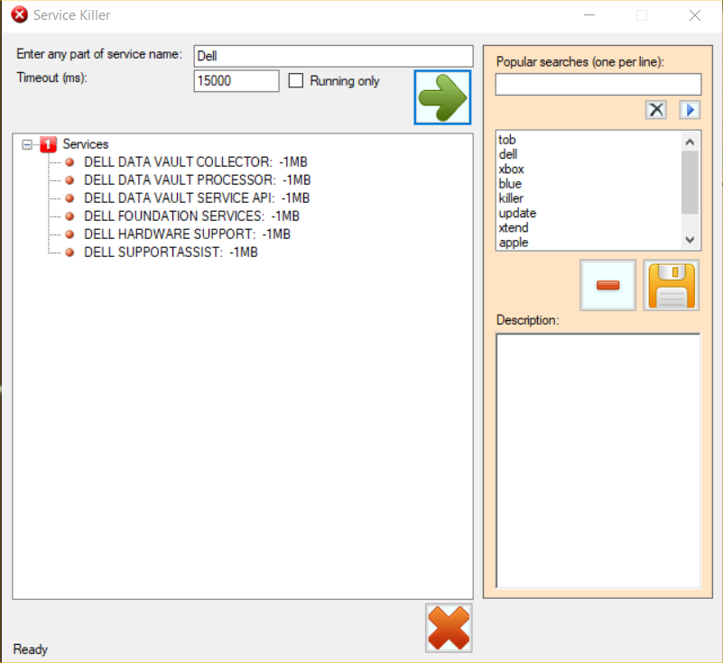

# ServiceKiller
Terminate services without disabling them.

So one day I got tired of opening the services app and stopping services I didn't necessarily want to disable, but did want stopped to free up memory (for whatever game I was playing). I created a simple app to search all the system services for part of a description, display them, right click to terminate (or use a button to terminate them all).

Notes:
- The app needs to be run as administrator
- Be aware of the timeout box. Some services can take a while to stop.

     

